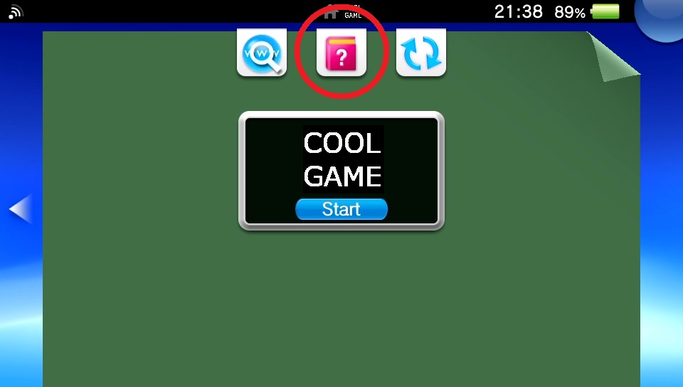
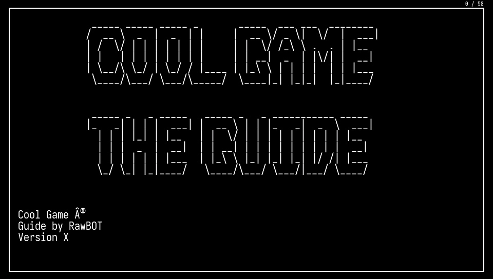
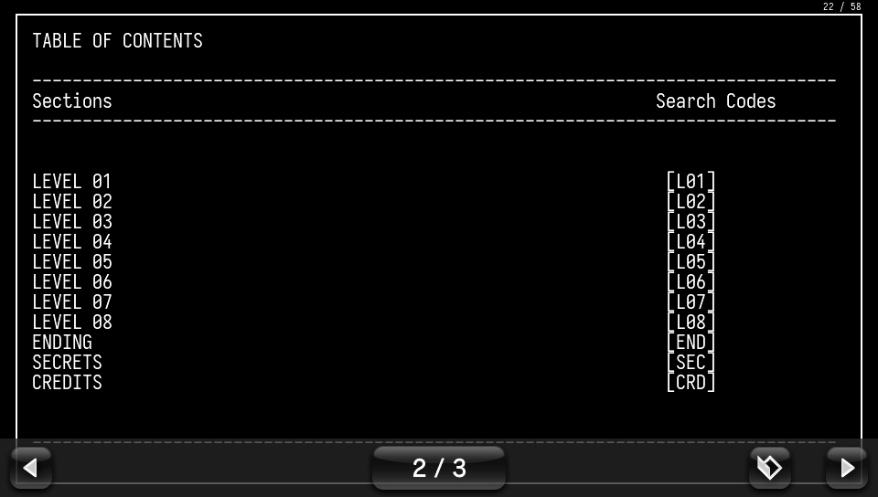

# Text to Vita Manual Converter

## Description

This script converts a text file into a format suitable to use as a Vita's Bubble manual. This works by rendering the text file into a series of PNG files, naming them as 001.png, 002.png, and so on, and maximizing as much space as possible.

It is intended to be used with text guides, like the ones found in sites like GameFAQs. It is configured to work with text files that follow console line width limitations (<80 characters per line) and most GameFAQs guides should follow this convention. With a font size of 22, it fits 22 lines per image. However, it can be configured by modifying the parameters in the script, such as changing the font, the font size, the number of lines in an image, etc.

<!-- 

-->

<table>
<tr>
<td></td>
<td></td>
<td></td>
</tr>
</table> 

## Usage

The script has the following dependencies:
* Python 3
* Pillow `pip install Pillow`

To use it, just pass the text file as the first argument:

`python main.py text-file-example.txt`

Similarly, the stand-alone version (all dependencies included) can be used by passing the text file as an argument:

`txt-to-vita-manual.exe text-file-example.txt`

## Output and Using the Manual on the Vita

PNG files will be outputted to an `Manual/` directory in the working dir. To use them on a bubble on the Vita, there's two options:

### Existing Manual
If the app/bubble you want to modify is a Vita game, or if it is a PSX/PSP bubble that already has a manual in the Live Area, then just copy and replace the PNG files in the app/bubble's directory, e.g. `ux0:app/<app-id>/sce_sys/Manual`. 

Note: this directory should already exist (every bubble with a working manual has it), and make sure to remove all files on this directory first.

### No manual
If the bubble you want to add the manual to doesn't have a manual already (No "manual" book icon in the Live Area of the bubble), then you need to use [Adrenaline Bubble Manager (ABM)](https://github.com/ONElua/AdrenalineBubbleManager).

- Copy the `Manual` directory produced by this script to `ux0:ABM/<any-dir>`. Note that the final directory where the PNG files are must be `ux0:ABM/<any-dir>/Manual/*.png` 
- On ABM, press `Circle` to modify bubbles, select your desired bubble and press `Cross` to "Inject imgs". 
- Navigate to `<any-dir>`, and you should see `Manual` in the screen. 
- Press `Start` to "load all images to the bubble", and wait for the process to finish. 
- After this, you'll now see the "manual" icon in the bubble's Live Area.
