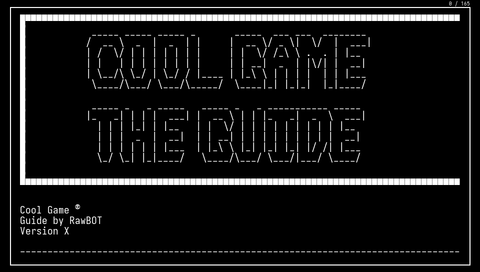
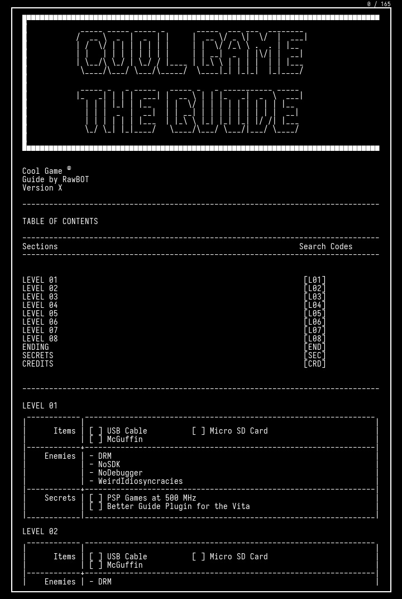
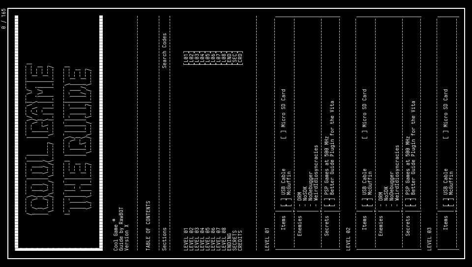

# Text to Vita Manual Converter

## Description

This program takes a URL to an online text guide or to a local text file, and converts it into a format suitable to use as a Vita's Bubble manual. This works by rendering the text file into a series of PNG files, naming them as 001.png, 002.png, and so on, and maximizing as much space as possible.

This currently **only works with PSP/PSX bubbles** created by the user (unencrypted `ux0:app/` directories).

It is intended to be used with text guides, like the ones found in sites like GameFAQs. It is configured to work with text files that follow console line width limitations (=<80 characters per line) and most GameFAQs guides should follow this convention. However, it can be configured into different modes by giving it input arguments (see [usage](#usage)).

If trying to download a GameFAQs guide, use the URL that opens the guide normally, e.g.:
`https://gamefaqs.gamespot.com/[console]/[game-id]/faqs/[faq-id]`

Currently it does not support HTML guides, only text-based ones.

<!-- 


-->

<table>
<tr>
<td></td>
<td></td>
<td></td>
</tr>
</table> 

## Modes

* **Fullscreen:** Native Fullscreen (960x544)
* **Native Width Scrollable:** Native Width with Scrolling (960x750)
* **Max Height Scrollable:** Max Possible Height with Scrolling (480x1500)
* **Minimum Width Scrollable:** Minimum Width with Scrolling (544x1420)
* **Best Width Scrollable:** 720px Width with Scrolling (720x1072)
* **Vertical:** Native Fullscreen, but rotated. Hold your Vita sideways! (544x960)

### Examples

[Link to examples](https://github.com/RawBOT/txt-to-vita-manual/tree/main/img)

<table>
<tr>
<td>Fullscreen</td>
<td>Best Width Scrollable</td>
<td>Vertical</td>
</tr>
<tr>
<td></td>
<td></td>
<td></td>
</tr>
</table>

## Usage

The script has the following dependencies:
* Python 3
* Pillow `pip install Pillow`
* BeautifulSoup4 `pip install beautifulsoup4`

Here are the usage instructions:

```
Usage: main.py [OPTIONS] FILE_URL

Converts a text file into PNG files to be used as a Vita manual.
If FILE_URL is remote (e.g. Internet), then it will be downloaded and processed.

Options:
  --version             show program's version number and exit
  -h, --help            show this help message and exit
  -o DIR, --outputdir=DIR
                        Output images to DIR
  -v, --verbose         Outputs detailed status per file.

  Vita Manual Mode, default="fullscreen":
    --fullscreen        Native Fullscreen (960x544)
    --native            Native Width with Scrolling (960x750)
    --maxheight         Max Possible Height with Scrolling (480x1500)
    --minwidth          Minimum Width with Scrolling (544x1420)
    --midwidth          720px Width with Scrolling (720x1072)
    --vertical          Native Fullscreen, but rotated. Hold your Vita sideways! (544x960)
```

### Examples

Output a local text file as standard "fullscreen" images:  
`python main.py test/test_simple.txt`

Output a local text file as "maxheight" images to a `output/` dir:  
`python main.py --maxheight -o output/ test/test_simple.txt`

Download a text guide and output it:
`python main.py https://example.com/text`

Download a text guide from this repo and output as "native" images:  
`python main.py --native https://raw.githubusercontent.com/RawBOT/txt-to-vita-manual/main/test/test_complex.txt`

Similarly, the stand-alone version (all dependencies included) can be used by by replacing `python main.py` with `txt-to-vita-manual.exe`

`txt-to-vita-manual.exe --fullscreen file.txt`

## Output and Using the Manual on the Vita

PNG files will be output by default to an `Manual/` directory in the working dir. The manual can only be replaced on non-encrypted Vita apps, so only PSP and PSX bubbles created by [Adrenaline Bubble Manager (ABM)](https://github.com/ONElua/AdrenalineBubbleManager). To use them on a bubble on the Vita, there's two options:

### Existing Manual
If the app/bubble you want to modify is a Vita game, or if it is a PSX/PSP bubble that already has a manual in the Live Area, then just copy and replace the PNG files in the app/bubble's directory, e.g. `ux0:app/<app-id>/sce_sys/Manual`. 

Note: this directory should already exist (every bubble with a working manual has it), and make sure to remove all files on this directory first.

### No manual
If the bubble you want to add the manual to doesn't have a manual already (No "manual" book icon in the Live Area of the bubble), then you need to use [Adrenaline Bubble Manager (ABM)](https://github.com/ONElua/AdrenalineBubbleManager).

- Copy the `Manual` directory produced by this script to `ux0:ABM/<any-dir>`. Note that the final directory where the PNG files are must be `ux0:ABM/<any-dir>/Manual/*.png` 
- On ABM, press `Circle` to modify bubbles, select your desired bubble and press `Cross` to "Inject imgs". 
- Navigate to `<any-dir>`, and you should see `Manual` in the screen. 
- Press `Start` to "load all images to the bubble", and wait for the process to finish. 
- After this, you'll now see the "manual" icon in the bubble's Live Area.
